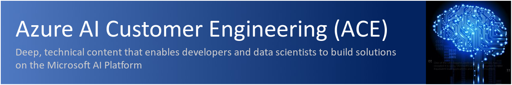
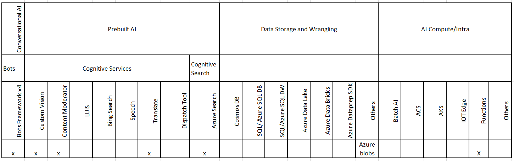

# Microsoft LATAM OCP Tech Team - Cognitive Search Bootcamp

<!--  -->

## IMPORTANT MESSAGE - CONTENT REFERENCE

This lab is based on the archived version of the repo https://github.com/Azure/LearnAI-KnowledgeMiningBootcamp which was retired in 2019, however the content has been updated in September 2020 so you can leverage the resources and learn how to implement Cognitive Search, an important change is introduced on this repo to deploy the Bot as a container, for reference on this lab we recommend start at least with Web App for containers, however feel free to embrace services like Azure Container Instance or AKS.

## About this course

In this course, you will create an enterprise search solution by applying knowledge mining to business documents like contracts, memos, presentations and images.

You will use Microsoft Azure AI technology to extract insights from unstructured data and expose the results in a Bot interface.

## Important note

There is a suggested data set to start and that is included on this repo, however feel free to add your own data to be indexed. Special considerations will be provided on the deployment of the Azure Resources so you can select which SKU of Azure Cognitive Search fits your needs.

## Goals

At the end of this training you will have learned:

+ **What** Azure Cognitive Search is
+ **How** to implement a Cognitive Search Solution
+ **Why** this technology can be useful for any company
+ **When** to use this solution for demos, POCs and other business scenarios

The hands-on labs will teach you how to use Microsoft Azure Cognitive Search combined with Microsoft Cognitive Services for entity recognition, image analysis, text translation and indexed search on enterprise business documents. This approach uses Artificial Intelligence to create an advanced search experience.

While this course focuses on Azure Cognitive Search capabilities, an in-depth course on building Bots and integrating various Azure Cognitive Services is available here - [Azure Cognitive Services Bootcamp](https://github.com/Azure/LearnAI-Bootcamp).

In this course we will cover these key concepts:

1. Fundamentals of Azure Cognitive Search and its capabilities

1. Knowledge Mining business scenarios

1. Building an enrichment data pipeline for search using predefined and custom skillsets:

    + Text skills like entity recognition, language detection, text manipulation and key phrase extraction
    + Image skills like OCR
    + Content moderation skills to detect documents with incompliant content

1. Use the enriched data for an advanced search experience for business documents within an enterprise.

1. Expose the knowledge mining solution using a bot interface for document search and consumption. We provide a starter solution of a ready to use bot in which you only have to provide the details on the Azure Cognitive Search to use and update about the Bot details so it can be consumed over Microsoft Teams or in a Web Chat using a web browser

### Architecture

### Technologies Covered

### Industry application

Intelligent search is relevant to many major industries. Some are listed below.

1. Retail and health care industries employ chat bots with advanced multi-language support capabilities to service their customers.

1. Retail, Housing and Automotive industries for sales/listing.

1. Law firms and legal departments can use this technology to enforce compliance or improve search capabilities.

### Pre-requisites

1. Fundamental working knowledge of Azure Portal, Azure Functions and Azure Cognitive Search
1. Familiarity with Visual Studio and minimum C# knowledge
1. Familiarity with Azure Bots and Microsoft Bot Framework v4
1. Familiarity with [Postman](https://www.getpostman.com/)

If you do not have any of the above pre-requisites, please find below links

1. *To Read (10 minutes):* [Visual Studio Tutorial](https://docs.microsoft.com/en-us/visualstudio/ide/visual-studio-ide)
1. *To Read (8 minutes):* [Azure Bot Service Overview](https://docs.microsoft.com/en-us/azure/bot-service/bot-service-overview-introduction?view=azure-bot-service-4.0)
1. *To Read (4 minutes):* [Azure Functions Overview](https://docs.microsoft.com/en-us/azure/azure-functions/functions-overview)  
1. *To Read (10 minutes):* [Azure Cognitive Search Overview](https://docs.microsoft.com/en-us/azure/search/search-what-is-azure-search)
1. *To Read (7 minutes):* [Postman Tutorial](https://docs.microsoft.com/en-us/azure/search/search-fiddler)
1. *To Do (30 minutes):* [C# Quickstart](https://docs.microsoft.com/en-us/dotnet/csharp/quick-starts/)

### Pre-Setup before you attend the class Mandatory

1. *To Create:* You need a Microsoft Azure account to create the services we use in our solution. You can create a [free account](https://azure.microsoft.com/en-us/free/), use your MSDN account or any other subscription where you have permission to create services
1. *To Install:* [Visual Studio 2019](https://www.visualstudio.com/vs/) or later, *including the Azure development workload*
1. *To Install:* [Postman](https://www.getpostman.com/). To call the labs APIs
1. *To Install:* [Bot Emulator](https://github.com/Microsoft/BotFramework-Emulator/releases), use the '.exe' file from release 4.1.0 or newer
1. *To Install:* [Git for Windows](https://gitforwindows.org/) or any other git app you prefer
1.  *To Install:* [Docker desktop](https://www.docker.com/products/docker-desktop/) to build the Bot image and deploy in Azure App Service Web App for containers

### Course Details

Primary Audience: Azure AI Developers, Solution Architects.
Secondary Audience:  Any professional interested in learning AI.

### Level

This content is designed as an intermediate to advanced level course for AI developers and/or architects.

### Type

This course, in its full form, is designed to be taught in-person/virtual but you can also use the materials in a self-paced fashion. There are assignments and multiple reference links throughout the materials that support the concepts and skills you will learn.

### Length

Full Course classroom training:  6 hours aprox

### Course Modules & time distribution

1. [Introduction](./resources/slides/cognitivesearch-introduction.pptx) – **Presentation** overview of Azure Cognitive Search, Cognitive Search, business scenarios and industry specific applications. - 1 hour

2. [Architecture](./resources/md-files/solution-architecture.md) – **Solution Architecture** for building enterprise search solution. ~ 30 mins

3. [Lab 1](./labs/lab-01-environment-creation.md) - **Environment Creation** ~ 30 mins

4. [Lab 2](./labs/lab-02-azure-cognitive-search.md) - **Indexing Blob Storage** ~ 30 mins

5. [Lab 3](./labs/lab-03-text-skills.md) - **Text Skills** ~ 30 mins

6. [Lab 4](./labs/lab-04-image-skills.md) – **Image Skills** ~ 30 mins

7. [Lab 5](./labs/lab-05-custom-skills.md) - **Custom Skills** ~ 60 mins

8. [Lab 6](./labs/lab-06-bot-business-documents.md) - Build and Integrate a **Bot** with the Search API and deploy in containers ~ 1.5 hours

> **Note**: Once you've completed the labs, we recommend deleting the resource group (and all the resources in it) to avoid incurring extra charges, unless you want to use this solution as a tool for demos and POCs. You can redeploy the used resources on free SKUs but consider the limitations of this option.

## Useful Links

+ [Using Azure-Functions-for-Python to create a Cognitive Search Filtering Custom Skill](https://techcommunity.microsoft.com/t5/AI-Customer-Engineering-Team/Using-Azure-Functions-for-Python-to-create-a-Cognitive-Search/ba-p/850106)

+ [Knowledge Mining Solution Accelerator (KMA v1.0)](https://techcommunity.microsoft.com/t5/AI-Customer-Engineering-Team/Announcement-Knowledge-Mining-Solution-Accelerator-KMA-v1-0/ba-p/805889)

+ [Mine knowledge from audio files with Microsoft AI](https://techcommunity.microsoft.com/t5/AI-Customer-Engineering-Team/Mine-knowledge-from-audio-files-with-Microsoft-AI/ba-p/781957)

+ [Start Today! Learn How to Create End-to-End Solutions with Microsoft AI](https://techcommunity.microsoft.com/t5/AI-Customer-Engineering-Team/Start-Today-Learn-How-to-Create-End-to-End-Solutions-with/ba-p/698422)

## Useful Links - Certifications

The LearnAI team had intense participation in the creation of the following new Microsoft certifications and its required tests:

+ [Azure Data Engineer​](https://www.microsoft.com/en-us/learning/azure-data-engineer.aspx)
  + DP-200: Implementing an Azure Data Solution
  + DP-201: Designing an Azure Data Solutions​

+ [Azure AI Engineer​](https://www.microsoft.com/en-us/learning/azure-ai-engineer.aspx)
  + AI-100: Designing and Implementing an Azure AI Solution

+ [Azure Data Scientist](https://www.microsoft.com/en-us/learning/azure-data-scientist.aspx)
  + DP-100: Designing and Implementing a Data Science Solution on Azure​

## Cognitive Services Compliance

Click [here](https://azure.microsoft.com/en-us/support/legal/cognitive-services-compliance-and-privacy/) to learn how Microsoft Cognitive Services handle your data.