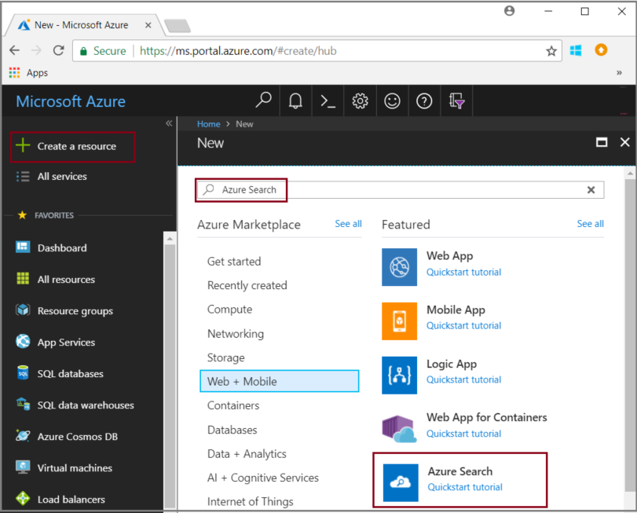
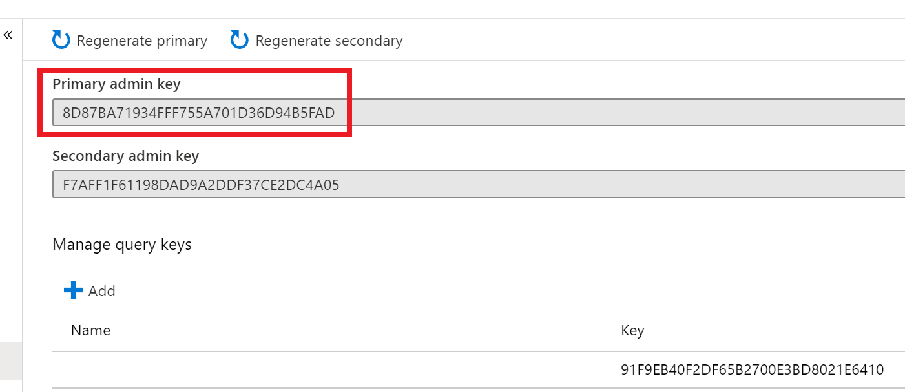

# Environment Creation

In this lab, you will create an Azure Cognitive Search service and a storage account. We recommend keeping both in a new and unique resource group, to make it easier to delete at the end of the workshop (if you want to). We will also upload the data to a blob storage within the storage account.

## Step 1 - Clone the Repo

https://github.com/luisruval/CognitiveSearch

Cloning the repo will download all the training materials to your computer, including the dataset, the slides and the code for the Bot project. If you have any git tool in your computer, you can run `git clone https://github.com/luisruval/CognitiveSearch.git` in your command prompt. Or simply follow the tasks below:

### Tasks - cloning the repo using zip file download

1. Open a browser window to the GitHub repository (<https://github.com/luisruval/CognitiveSearch>).

1. Select **Clone or download**, then select **Download Zip**.

1. Extract the zip file to your local machine, be sure to keep note of where you have extracted the files.

## Step 2 - Create the Azure Cognitive Search service

1. Go to the [Azure portal](https://portal.azure.com) and sign in with your Azure account.

1. Create a new resource group, select **Resources groups**, then select **Add**.  Select a subscription, type a name for the group, such as **INIT-kmb** and then select a region.  Select **Review + Create**, then select **Create**

1. In the resource group, select **+Add**.  

1. Search for **Azure Cognitive Search**, select **Azure Cognitive Search**, then select **Create**.

>**NOTE** In addition to facilitating organization and visualization in the portal, using a single resource group helps you, if necessary at the end of the training, remove all services created. If you want to keep this solution up and running, for demos and POCs in minutes with your own data, this resource cleaning isn't necessary.

>**NOTE** See [Create an Azure Cognitive Search service in the portal](https://docs.microsoft.com/en-us/azure/search/search-create-service-portal) if you are setting up a search service for the first time, and use the bullet point list below for the details you will use to fill out the details for the Azure Cognitive Search service.

  

1. Ensure your newly created resource group is selected.  

1. For the **URL**, type your service name, choose a name that you can easily remember. We will use it many times in the labs.

> **Note** The name of the service in the screenshots of this lab won't be available, you must create your own service name.

1. For **Location**, choose one of [these](https://azure.microsoft.com/en-us/global-infrastructure/services/?products=search) regions. Suggested regions are:

- West Central US
- South Central US
- North Central US
- East US
- East US 2
- West US
- West US 2
- Canada Central
- West Europe
- UK South
- North Europe
- Brazil South
- East Asia
- Southeast Asia
- Central India
- Australia East

1. For **Pricing tier**, select **Standard**.  

>**NOTE** For deeper information on Azure Cognitive Search pricing and limits, review [pricing](https://azure.microsoft.com/pricing/details/search/) and [capacity](https://docs.microsoft.com/en-us/azure/search/search-limits-quotas-capacity). Please note that you can try using the Free tier, however the maximum characters of content extracted from a blob will be 32,000 instead of 4 million for a Standard SKU or 64,000 if considering a Basic option.

1. Select **Review + Create**, then select **Create**

1. Once the service is created, under **Settings**, select **Keys**

1. Copy the **Primary admin key** to notepad or similar text editor for use later in the labs.

  

> **Note** Azure Cognitive Search must have 2 replicas for read-only SLA and 3 replicas for read/write SLA. This is not addressed in this training. For more information, select [here](https://azure.microsoft.com/en-us/support/legal/sla/search/v1_0/)

## Step 3 - Create the Azure Blob service and upload the dataset

The enrichment pipeline pulls from Azure data sources. Source data must originate from a supported data source type of an [Azure Cognitive Search indexer](https://docs.microsoft.com/en-us/azure/search/search-indexer-overview). For this exercise, we use blob storage to showcase multiple content types.

Please note that in this training we are not creating a solution for production environments. Many parameters and processes are not aligned with best performance and safety practices. An example is the type of access of the storage account containers, what will be in this step. And that's by design, to make it easier for us to visualize the data.

1. From the resource group, select **+Add**.  Search for **storage account**, select it, then select **Create**

1. Ensure your newly created resource group is selected. This resource group should be used for all services of this training, not only for this storage account. Use a name that allows you to easily identify these resources in the future, such as  **kmb-rg**

1. Type a unique name for your storage account, such as **INITkmbstorage**.

>**NOTE** This name can contain only lowercase letters and numbers. It also must have between 3 and 24 characters

1. Select the **same location** as your Azure Cognitive Search resource.  This will help to avoid latency.

1. For performance, select **Standard**

1. For **account kind**, select **StorageV2**

1. For replication, select **Locally-redundant storage LRS**

1. Select **Review + create**, then select **Create**

1. From the storage account **Overview** tab, select the link to **Containers**. We will create 2 containers.

1. Select the **+Container** link. For the name type `projections`

1. Select **Container** for Access Type, then select **OK**

1. Select the **+Container** link. For the name type `basicdemo`

1. Select **Container** for Access Type, then select **OK**

1. Select the new **basicdemo** container, then select **Upload**.  Browse to the **\resources\dataset** cloned github folder.

1. Select all the files, then select **Open**

1. Select **Upload**, wait for all the files to upload.

 > **Note** You can also use the [Azure Storage Explorer](https://docs.microsoft.com/en-us/azure/storage/blobs/storage-quickstart-blobs-storage-explorer) to upload files. If you use the Storage Explorer, be careful not to create another folder level. This training is created with the assumption that all of the data is located in the root folder of the container.

After the upload, please follow these 3 steps:

- Ensure that all 20+ files from the `dataset` folder were uploaded to the **basicdemo** container

- Navigate back to the storage account blade, under **Settings**, select **Access keys**.

- Copy the **key1** **Connection string** by selecting the copy button.  Save the key to notepad or similar text editor.

## Step 4 - Create the Cognitive Services Account

A Cognitive Services resource is needed in order to enrich more than 20 documents per day in Azure Cognitive Search indexing.

1. From the resource group, select **+Add**.  Search for **cognitive services**, select it, then select **Create**

2. For the name, type **INIT-kmb-cog-serv**

3. For the location, select the same resource group as your search and storage account

4. For the pricing tier, select **S0**

5. Check the **I confirm I have read and understood the notice below** checkbox

6. Select **Create**

## Next Step

[Azure Cognitive Search Lab](../labs/lab-02-azure-cognitive-search.md) or [Back to Read Me](../README.md)