# Azure Cognitive Search Fundamentals

In this lab, you will learn the basics of the Azure Cognitive Search service and how to ingest and index a provided data set using the built-in tools. This lab will teach you how to use the **Azure Portal** to ingest and search the business documents of the [provided data set](../resources/dataset). For more details on the required environment for this lab, including the data set and the Azure Service, click [here](../labs/lab-01-environment-creation.md).

## What is Azure Cognitive Search

[Azure Cognitive Search](https://docs.microsoft.com/en-us/azure/search/search-what-is-azure-search) is a search-as-a-service solution allowing developers to incorporate great search experiences into applications without managing infrastructure or needing to become search experts.

Developers look for PaaS services in Azure to achieve better and faster results in their apps. While search is a key to many types of applications, web search engines have set the bar high for search. Users expect: instant results, auto-complete as they type, highlighting hits within the results, great ranking, and the ability to understand what they are looking for, even if they spell it incorrectly or include extra words.

Search is a hard and rarely a core expertise area. From an infrastructure standpoint, it needs to have high availability, durability, scale, and operations. From a functionality standpoint, it needs to have ranking, language support, and geo-spatial capabilities.

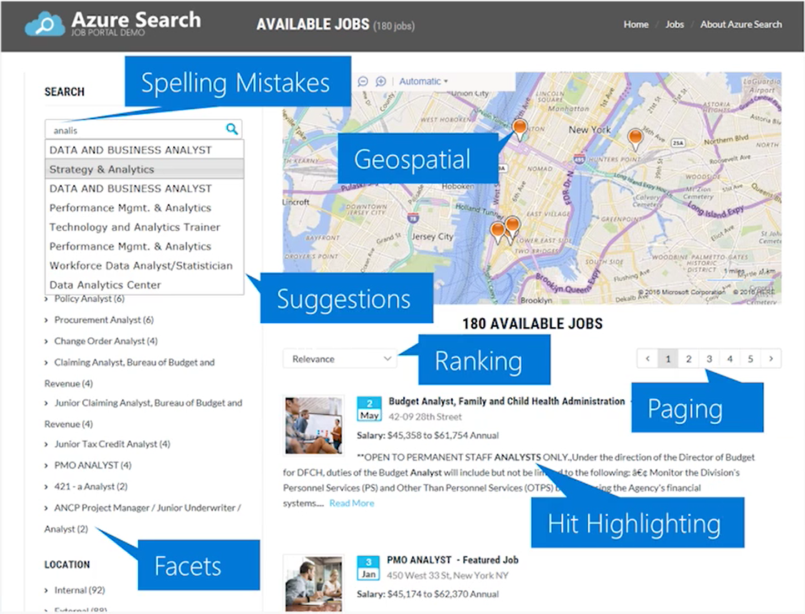

The example above illustrates some of the components users are expecting in their search experience. [Azure Cognitive Search](https://docs.microsoft.com/en-us/azure/search/search-what-is-azure-search) can accomplish these user experience features, along with giving you [monitoring and reporting](https://docs.microsoft.com/en-us/azure/search/search-traffic-analytics), [simple scoring](https://docs.microsoft.com/en-us/rest/api/searchservice/add-scoring-profiles-to-a-search-index), and tools for [prototyping](https://docs.microsoft.com/en-us/azure/search/search-import-data-portal) and [inspection](https://docs.microsoft.com/en-us/azure/search/search-explorer).

### How it works

Azure Cognitive Search uses a structure called inverted index, which is designed to allow very fast full-text searches. An inverted index consists of a list of all the unique words that appear in any document,
and for each word, a list of the documents in which it appears. In the indexing process, Azure Cognitive Search splits the content of each document into separate words, creates a sorted list of all the unique terms,
and then lists in which document each word appears.

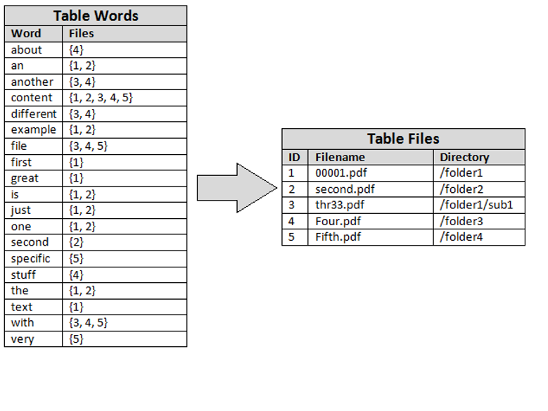

### Concurrency

When managing Azure Cognitive Search resources such as indexes and data sources, it's important to update resources safely, especially if resources are accessed concurrently by different components of your application. When two clients concurrently update a resource without coordination, race conditions are possible. To prevent this, Azure Cognitive Search offers an optimistic concurrency model. There are no locks on a resource.
Instead, there is an ETag for every resource that identifies the resource version so that you can craft requests that avoid accidental overwrites.
For more information, click [here](https://docs.microsoft.com/en-us/azure/search/search-howto-concurrency).

### Competitors

The table below is an independent analysis of the biggest competitors.
While it is not an official Microsoft position (there is no formal battle card), the table below can help with future studies and discussions. Azure Cognitive Search works with Office and pdf documents by design, but it is Cognitive Search that boosts the product to be able to index images and extract conceptual understanding from the data.

Support for data sources including MySQL, CosmosDB, and Azure SQL is also a competitive advantage.

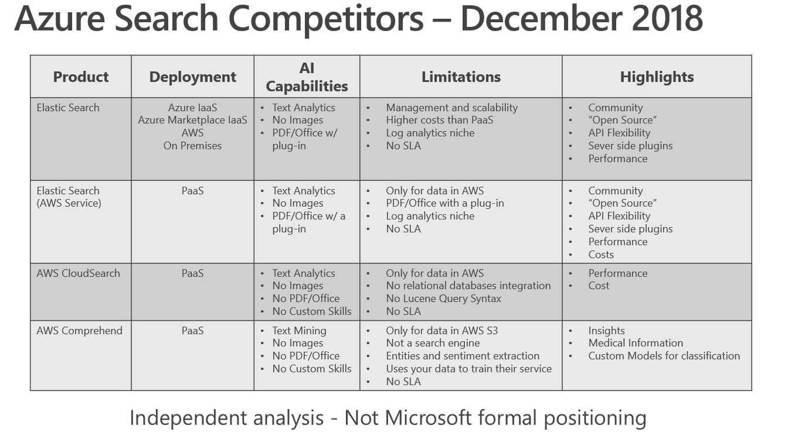

### Other Microsoft Search Options

Here are other Microsoft Search products or features. Use the table below as a reference, but always check the products specs for more detailed information.

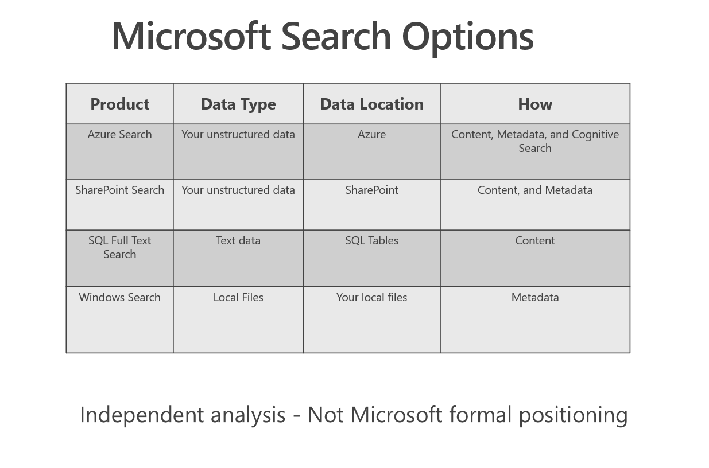

+ For the Azure Cognitive Search documentation, click [here](https://azure.microsoft.com/en-us/services/search/)

+ For the SharePoint Search documentation, click [here](https://docs.microsoft.com/en-us/sharepoint/dev/general-development/search-in-sharepoint)

+ For SQL Server Full Text Search documentation, click [here](https://docs.microsoft.com/en-us/sql/relational-databases/search/full-text-search?view=sql-server-2017)

+ For the Windows Search documentation, click [here](https://docs.microsoft.com/en-us/windows/desktop/search/windows-search)

### SLA

Azure Cognitive Search SLA is 99.9% availability for index query requests when an Azure Cognitive Search Service Instance is configured with two or more replicas, and index update requests when an Azure Cognitive Search Service Instance is configured with three or more replicas. No SLA is provided for the Free tier. **Search Service Instance** is an Azure Cognitive Search service instance containing one or more search indexes. **Replica** is a copy of a search index within a Search Service Instance. **This is a key point to be addressed with clients**.

Service level agreements (SLA) for Azure Cognitive Search are targeted at query operations and at index updates that consist of adding, updating, or deleting documents. Basic tier tops out at one partition and three replicas. If you want the flexibility to immediately respond to fluctuations in demand for both indexing and query throughput, consider one of the Standard tiers.

### Sizing, Performance, High Availability

Azure Cognitive Search pricing is based on **Search Units** (SU), which formula is listed below. When creating the service, you need to choose a tier based on the limits and on the required SUs for your scenario.

```http
SU = Partitions x Replicas
```

**Partitions** provide index storage and I/O for read/write operations (for example, when rebuilding or refreshing an index). It is a good practice to add partitions to your index for search performance in big data scenarios. The search engine knows what the required partitions are, avoiding IO. This concept is related to performance and depends on your data.  

**Replicas**, as mentioned above, are instances of the search service, used primarily to load balance query operations. Each replica always hosts one copy of an index. If you have 12 replicas, you will have 12 copies of every index loaded on the service. This concept is related to availability and performance, since you can balance the load on the replicas.

Because it's easy and relatively fast to scale up, we generally recommend that you start with one partition and one or two replicas, and then scale up as query volumes build. Query workloads run primarily on replicas. If you need more throughput or high availability, you will probably require additional replicas.

General recommendations for high availability are:

+ Two replicas for high availability of read-only workloads (queries)
+ Three or more replicas for high availability of read/write workloads (queries plus indexing as individual documents are added, updated, or deleted)

General recommendations for large datasets:

+ Partition your data into multiple blob containers or virtual folders
+ Set up several Azure Cognitive Search data sources, one per container or folder
+ Create a corresponding indexer for each data source. All the indexers can point to the same target search index
+ One search unit in your service can run one indexer at any given time. Creating multiple indexers as described above is only useful if they really run in parallel. To run them in parallel, you need one SU for each indexer.

Another important feature is Search traffic analytics. It lets you gain visibility into your search service and unlock insights about your users and their behavior. By having data about what your users choose, it's possible to make decisions that further improve your search experience, and to back off when the results are not what expected. For more information, click [here](https://docs.microsoft.com/en-us/azure/search/search-traffic-analytics).

>Note! After an Azure Cognitive Search service is provisioned, it cannot be upgraded to a higher SKU. You must create a search service at the new tier and reload your indexes.

For more information about Partitions and Replicas, click [here](https://docs.microsoft.com/en-us/azure/search/search-capacity-planning).

### Security

Azure Cognitive Search has the following security features:

+ GDPR, Standard Azure OST (Online Service Terms)
+ Security filters for trimming results (Your documents must include a field specifying which groups have access)
+ Role-based access controls (RBAC)
+ Filter content based on user identity
+ Standards compliance: ISO 27001, SOC 2, HIPAA
+ Encrypted transmission and storage
+ Multi-tenant scenarios
  + Index per tenant
  + Service per tenant

### Partial or incremental indexing

Once an index is in production, focus shifts to incremental indexing, usually with no discernable service disruptions. Partial or incremental indexing is a content-only workload that synchronizes the content of a search index to reflect the state of content in a contributing data source. A document added or deleted in the source is added or deleted to the index.

When using indexers that crawl external data sources, change-tracking mechanisms in source systems are leveraged for incremental indexing.

+ For Azure Blob storage, a lastModified field is used
+ On Azure Table storage, timestamp serves the same purpose
+ Similarly, both Azure SQL Database indexer and Azure Cosmos DB indexer have fields for flagging row updates

When you have 2 instances of the same indexer running at the same time, each execution will process the existing delta in the execution start moment. There is no overlap, the system blocks for each execution the work to be done.

### Add, Update or Delete Documents

You can upload, merge or delete documents from a specified index using HTTP POST. You can combine actions, such as an upload and a delete, in the same batch.

+ **upload**: Similar to an "upsert" where the document will be inserted if it is new and updated/replaced if it exists. Note that all fields are replaced in the update case

+ **merge**: Updates an existing document with the specified fields. If the document doesn't exist, the merge will fail. Any field you specify in a merge will replace the existing field in the document

+ **mergeOrUpload**: This action behaves like merge if a document with the given key already exists in the index. If the document does not exist, it behaves like upload with a new document

+ **delete**: Delete removes the specified document from the index. Note that any field you specify in a delete operation, other than the key field, will be ignored. If you want to remove an individual field from a document, use merge instead and simply set the field explicitly to null

For more information, click [here](https://docs.microsoft.com/en-us/azure/search/search-what-is-data-import).

All indexers support scheduling so that you can specify how frequently the data is to be refreshed. Most indexers provide change tracking if the data source supports it. By tracking changes and deletes to existing documents in addition to recognizing new documents, indexers remove the need to actively manage the data in your index.

### Service Limits

The service limits for this training are listed below. For the complete list, click [here](https://docs.microsoft.com/en-us/azure/search/search-limits-quotas-capacity).

| Resource / Tier | Free | Basic | Standard S1 | Standard S2 | Standard S3 | Storage Optimized L1 | Standard Optimized L2
|-------|----------|----------|----------|----------|----------|----------|----------|
| SLA | No | Yes| Yes | Yes | Yes | Yes | Yes |
| Storage per Partition | 50 MB | 2 GB | 25 GB | 100 GB | 200 GB | 1 TB | 2 TB |
| Partitions | 1 | 1 | 12 | 12 | 12 | 12 | 12 |
| Replicas | N/A | 3 | 12 | 12 | 12 | 12 | 12 |
| Maximum Indexes | 3 | 15 | 50 | 200 | 200 or 1000/pertition in HD mode | 10 | 10 |
| Maximum Indexers | 3 | 15 | 50 | 200 | 200 | 10 |10 |
| Maximum fields per Index | 1000 | 100 | 1000 | 1000 | 1000 |1000 |1000 |
| Total Documents | 10,000 | 1 million | 15 million per partition | 60 million per partition | 120 million per partition | TBD | TBD |
| Maximum Skillsets | 3 | 15 | 50 | 200 | 200 | 10 |10 |
| Maximum File size | 16 MB | 16 MB | 128 MB|  256 | 256 | 256 | 256 |
| Maximum characters per File (blob) | 32,000 | 64,000 | 4 million |  4 million | 4 million | 4 million | 4 million |

>Note 1: Azure Cognitive Search also offers the **S3 High Density (S3 HD) tier**, engineered for specific workloads: multi-tenancy and large quantities of small indexes (one million documents per index, three thousand indexes per service). This tier does not provide the indexer feature, can't be used for Cognitive Search. On S3 HD, data ingestion must leverage the push approach, using API calls to push data from source to index.
>
>Note 2: Now in preview, two new service tiers for Storage Optimized workloads in Azure Cognitive Search. These L-Series tiers offer significantly more storage at a reduced cost per terabyte when compared to the Standard tiers, ideal for solutions with a large amount of index data and lower query volume throughout the day, such as internal applications searching over large file repositories, archival scenarios when you have business data going back many years, or e-discovery applications.

### Typical Workflow

1. **Provision service:** You can create or provision an Azure Cognitive Search service from the [portal](https://docs.microsoft.com/en-us/azure/search/search-create-service-portal) or with [PowerShell](https://docs.microsoft.com/en-us/azure/search/search-manage-powershell).

1. **Create an index:** An [index](https://docs.microsoft.com/en-us/azure/search/search-what-is-an-index) is a container for data, think "table". It has schema, [CORS options](https://docs.microsoft.com/en-us/aspnet/core/security/cors), search options. You can create it in the [portal](https://docs.microsoft.com/en-us/azure/search/search-create-index-portal) or during [app initialization](https://docs.microsoft.com/en-us/azure/search/search-create-index-dotnet).

1. **Index your data:** There are two ways to [populate an index with your data](https://docs.microsoft.com/en-us/azure/search/search-what-is-data-import). The first option is to manually push your data into the index using the Azure Cognitive Search [REST API](https://docs.microsoft.com/en-us/azure/search/search-import-data-rest-api) or [.NET SDK](https://docs.microsoft.com/en-us/azure/search/search-import-data-dotnet). The second option is to point a [supported data source](https://docs.microsoft.com/en-us/azure/search/search-import-data-portal) to your index and let Azure Cognitive Search automatically pull in the data on a schedule.

1. **Search an index:** When submitting search requests to Azure Cognitive Search, you can use simple search options, you can [filter](https://docs.microsoft.com/en-us/azure/search/search-filters), [sort](https://docs.microsoft.com/en-us/rest/api/searchservice/add-scoring-profiles-to-a-search-index), [project](https://docs.microsoft.com/en-us/azure/search/search-faceted-navigation), and [page over results](https://docs.microsoft.com/en-us/azure/search/search-pagination-page-layout). You can address spelling mistakes, phonetics, and Regex, and there are options for working with search and [suggest](https://docs.microsoft.com/en-us/rest/api/searchservice/suggesters). These query parameters allow you to achieve deeper control of the [full-text search experience](https://docs.microsoft.com/en-us/azure/search/search-query-overview).

## Lab Steps

Let's start the hands-on lab. Since you have finished the [Environment Creation](../labs/lab-01-environment-creation.md), you just need to follow the steps below.
**Please note that the product team is always optimizing the portal. If you find any difference, please report via GitHub Issues then try to understand what has changed to move forward with the lab.**

### Step 1 - Import Data from a new data source

Using the Azure Cognitive Search service created in the previous lab, you will use the "Import Data" wizard, that helps you with all required steps to ingest and analyze your data: data source and index creation.

1. Navigate to your Azure Cognitive Search resource.

2. From the Overview tab, select the **Import Data** option

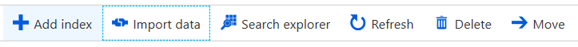

1. Choose the **Azure Blob Storage** Data Source and name it as `lab1data`.

1. Choose the **Content and Metadata** option, we want to index not only the files properties but also their content.

1. Choose the **Default** parsing mode, since the data set also has pdfs. The **Text** option has performance advantage, but that's not what we want because of the characteristics of our data set.

1. In the **Connection string** add the connection string collected in the previous lab.

1. In the **Container name**, type **basicdemo**. You can skip Blob Folder and Description.

1. Select **Next: Add cognitive search (Optional)**.  After you select the blue button, you will wait a few seconds because Azure Cognitive Search will be detecting (sampling) the schema and the metadata of the data set

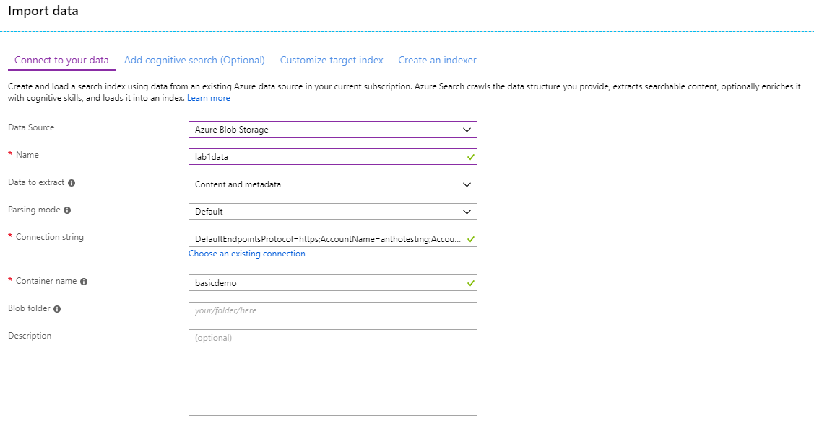

> **NOTE** You may get an error if you did not wait for the Azure Cognitive Search instance to fully deploy.  In some cases this could take up to 20 minutes.

### Step 2 - Attach Cognitive Services

1. Expand the **Attach Cognitive Services** link and select the Cognitive Services account you created in the last step of the [previous lab](../labs/lab-01-environment-creation.md)

> **Note** If you don't see it listed for you, select **Create new Cognitive Services resource** and follow the tutorial. It will open the Azure Portal in a new browser window. After you have finished, return to the previous window where we are using the Azure Cognitive Search wizard to import data.

1. Expand the **Add Enrichments** link

1. Name your skillset as `myportalskillset`

1. Select the enable OCR checkbox.  This will alow us to submit both content and image text to the cognitive skills

1. Ensure `Source data field` is set to **merged_content**

1. Check all the skill checkboxes for both Text and Image skills

1. Expand the **Save enrichments to a knowledge store** link, check all the projection checkboxes.

1. Copy the storage account connection string into the textbox.

1. Check all the checkboxes

1. For the container name, type **projections**

1. Select the **Next: Customize target index** button

1. Name your index as `myportalindex`

1. **Keep `metadata_storage_path` as the key.** This is a unique identifier for each file of the data source. It is a good idea to use the physical path of file, since it is unique by design. Since our dataset is on blob storage, the content of this field is the file URL, that's why it is unique by design. If you check the other options, you will see that metadata_storage_path is only one field that can guarantee uniqueness. As of December 2018, the key maximum size is 1024 characters. This limit won't be a problem for this training, but the workaround is to reduce the file name length and also the path. This limit is currently under analysis of the product team.

1. Name the **Suggester** as `myportalsuggester`

1. Set the **Search Mode** to **"analyzingInfixMatching".** The Suggester feature provides type-ahead suggestions, as you can see in web search engines like [Bing](www.bing.com).

+ Notice the fields available:
  + content: all text from the documents that exists when they are cracked (opened) by Azure Cognitive Search
  + metadata*: all physical information Azure Cognitive Search can retrieve from the filesystem, or database
  + all others: created in the Cognitive Search blade of the Wizard when you selected the various skills

+ This are the options available:

  + **Retrievable:** Fields returned to the application by default. It is possible to specify a field, by if it is not retrievable, there will be no data for it. Please notice the datatypes: strings, Integer, Datetime, and collection of strings, as an array that allow you the manipulate individual values. In a parallel with the SQL language, this is the `SELECT clause`

  + **Filterable:** For filtering on these fields. In a parallel with the SQL language, this is the `WHERE clause`

  + **Sortable:** For sorting on these fields. In a parallel with the SQL language, this is the `ORDER BY clause`

  + **Facetable:** For grouping results on these fields. In a parallel with the SQL language, this is the `GROUP BY clause`

  + **Searchable** For searching on these fields. In a parallel with the SQL language, this is the `HAVING clause`
  
  + **Analyzer:** For dictionary matching. The Analyzer takes the terms a user enters and works to find the best matching terms in the Index. Azure Cognitive Search includes analyzers that are used in technologies like Bing and Office that have deep understanding of 56 languages. For the full list, click [here](https://docs.microsoft.com/en-us/rest/api/searchservice/language-support). It is a good idea to add analyzer for the **searchable** fields, for a better user experience

  + **Suggester:** For suggestions while the user is typing. It is a good idea to add suggester for string **filterable** fields, for a better user experience

As you can see, not all fields should be retrievable or filterable and so on. We are setting all fields as retrievable so you can analyze what they mean, at the end of this lab. Also, each selected checkbox represents more processing (and time) required to ingest data. And before any best practice, there are the business rules.

1. Set your configuration like the image below, select the blue **Next: Create an indexer** button. A validation will be made.

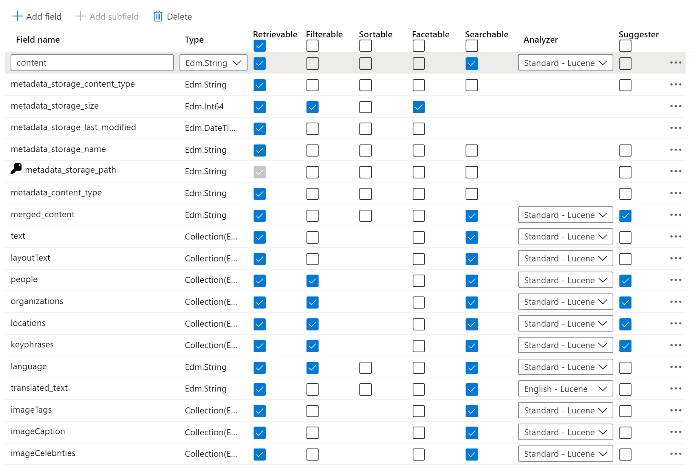

> **Note** Using the Azure portal you can't map the source fields more than once (i.e. to change you have to start over). In the next labs, you will create the index and the indexer using API calls, and that **does** allow you to do it. It is also important to realize that you only have the file's metadata to work with. In the next labs you will use Cognitive Search to create metadata from your data, and, as a result, your index will be completely different.

1. Name your indexer as `myportalindexer`. The indexer is the job that connects the data source, the index and the schedule.

1. Set the schedule as **once**

1. Expand the **Advanced Options** link

1. Set **Max failed items** to `-1`, we don't want the indexer to stop processing a document even when any cognitive skill has an error

1. Set **Max failed items per batch** to `-1`, we don't want the indexer batch job to stop at any reason

1. Set **Data to extract** to `Content and metadata`, since we are using both as you can see above

1. Set **Parsing mode** to Default, we have both text and image skills

1. Select the blue **Submit** button, and you will be redirected to the overview tab, where now you can see 1 index, 1 indexer and 1 data source (you may have to refresh your page).

1. Select the Indexes, Indexers, Data sources, and Skillsets tabs to see the objects you just created using the portal. In the next lab, you will learn how to create them with REST API calls

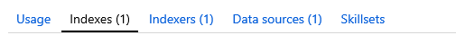

### Step 3 - Check Indexer Execution Status

1. To monitor data import, select the **Indexers** link (it is in the middle of the page and you can also see it in the middle of the image above). It should be **In progress**. Wait until you get the **Warning** status, it is expected to have some warnings. 

   + You may need to select the `Refresh` link in the top of the **Overview** tab
   + If you received an error, review and validate you followed the lab steps correctly
   + If your indexer has a status showing that is not running or have never ran before, select the indexer and run it manually by selecting **Run**

> **Note** If it is taking a long time for your indexer to index your content, check that you created Azure Cognitive Search and the Storage Account resources in the same region.

1. You should see the newly created indexer in the list, with status indicating "In progress", "Failed", or "Warning". If not, select the refresh button in the top-middle of the overview tab. The final expected status is "Warning", along with the number of documents indexed. Warnings are caused by extra long words and big texts. The indexer knows how to deal with them, but warns you.

2. Select the refresh button, top middle of the page, until the execution is over. The "Warning" status is expected, select the Indexer name to see the summary. In this page you will see all the executions this Indexer may have and its details, duration and so on.

3. Select the **Execution Details** row to see the warning messages, you should find problems related to missing values and truncated text. The first message is caused by long texts and the second is very clear on what is going on. Both problems will be addressed in the Cognitive Search labs, helping you to understand the value of this capability.

4. Let's check what else you can do in the Indexer page. Select the **Edit** link. As you can see, also in the image below, there are some interesting options here.

+ You can change the target Index
+ You can schedule your Indexer again
+ You can check "Advanced Options". Select this option to see:
  + Base-64 Encode Keys. This is the algorithm used encode the data of your index key. It is the default option of the Index creation and this encryption avoids a typical problem of the metadata_storage_path, our recommended field for the documents key, as mentioned in the previous step. The storage path will have characters like "/" that are not allowed in a key. That's a **paradox**, we "have to use" metadata_storage_path but typically it has invalid characters. The Base-64 encryption fixes this problem. It also means that the data within the Azure Cognitive Search Index is protected and your app needs to decrypt it to read in "human format".
  + You will also see options for max errors per execution, items per execution, execution size and so on.
  + Note that you can change the "Data to extract" and the "Parsing mode" options.

    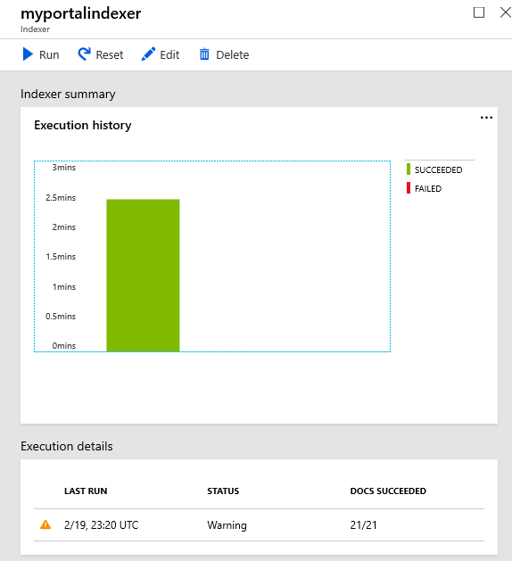

### Step 4 - Query the Azure Cognitive Search Index

Azure Cognitive Search implements two Lucene-based query languages: [Simple Query Parser](https://lucene.apache.org/core/4_7_0/queryparser/org/apache/lucene/queryparser/simple/SimpleQueryParser.html) and the [Lucene Query Parser](https://lucene.apache.org/core/4_10_2/queryparser/org/apache/lucene/queryparser/classic/package-summary.html). In Azure Cognitive Search, the simple query syntax excludes the fuzzy/slop options.

The image below explains how Azure Cognitive Search executes a query. The process has four stages:

1. Query parsing
1. Lexical analysis
1. Document retrieval
1. Scoring

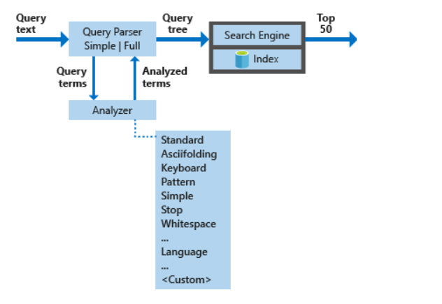

At this point of the lab, we can try searching the index. Let's keep on using the Azure Portal for this.

1. Navigate back to the **Overview Tab** of the Azure Cognitive Search service and select the **Indexes** link, the second from the left to the right. You should see the "Document Count" and the Storage Size. The expected count is 20 and the size should be close to 10.89 MiB. As you can see, Azure Cognitive Search doesn't store all the document contents, just parts of them: key words, metadata, tags.

1. Select the **Search Explorer** link.

1. Select **Search** to search for all documents. You can use any valid simple or full Lucene query syntax to create the request. The `*` character is equivalent to an empty or unspecified search that returns all documents in no particular order.

   + You should see information returned for all the 20 documents
   + Analyze all the fields and try to understand what they mean, what information they have
   + The score is an indicator of an item's relevance in the context of the current search operation. The higher the score, the more relevant the item. In search results, items are rank ordered from high to low, based on the search scores calculated for each item

1. Try searching for "Microsoft", a different result set is expected. In the resulting json, you'll see a number after `@search.score`. Scoring refers to the computation of a search score for every item returned in search results.

1. You will probably see results like the image below. Scroll down until you see all meta information available.

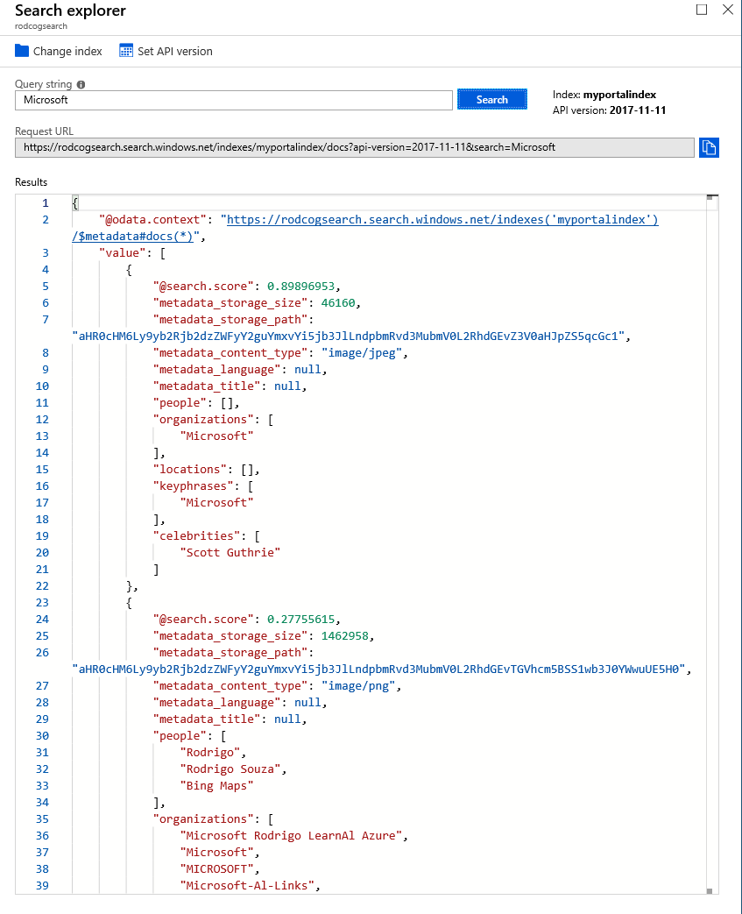

## Challenge

Using [Azure Cognitive Search Simple Query Syntax](https://docs.microsoft.com/en-us/rest/api/searchservice/simple-query-syntax-in-azure-search) and [Lucene query syntax](https://docs.microsoft.com/en-us/azure/search/query-lucene-syntax), try to create queries for the following situations:

1. Return only the first document
1. Search documents where words "Microsoft" and "Cloud" are up to 20 words distant one from the other
1. Search for documents about Cloud, ordering the results by the score
1. Search for documents about Cloud, but filtering those with mentions to Oracle
1. Search for documents about Cognitive Services and Bots
1. Search for all celebrities, returning this field only

## Finished Solution

If you could not make it, [here](../resources/finished-solutions/finished-solution-lab-02-azure-search.md) is the challenge solution. You just need to follow the steps.

## Extra Content

The links below will work only with the API, which you will learn in the next labs. While you will not use it in these labs, check them now to learn more about other Azure Cognitive Search capabilities.

[Azure Cognitive Search's `moreLikeThis`](https://docs.microsoft.com/en-us/azure/search/search-more-like-this) feature is a feature to find documents that are similar to the document specified by the document key.

[Synonyms](https://docs.microsoft.com/en-us/azure/search/search-synonyms) is a feature that allows you to search on previously mapped terms. Example: If you map MSFT as Microsoft, both searches will have the same results.

[Lucene Query Syntax](https://docs.microsoft.com/en-us/azure/search/search-query-lucene-examples) is also supported, giving you more flexibility to meet your business requirements.

## Next Step

[Text Skills Lab](../labs/lab-03-text-skills.md) or [Back to Read Me](../README.md)