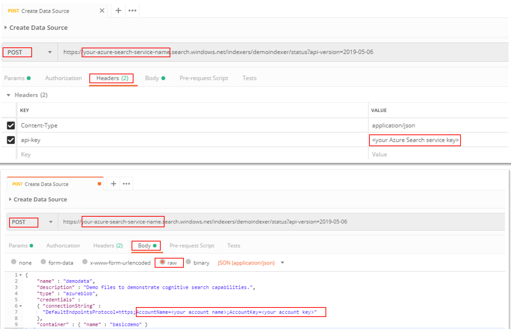
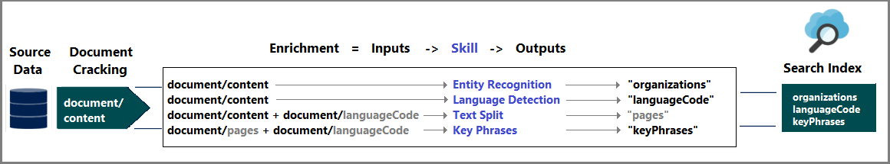

# Create a Cognitive Search Enrichment Process with **Text** Skills

In this lab, you will learn the mechanics of programming data enrichment in Azure Cognitive Search using *cognitive skills*. Cognitive skills are natural language processing (NLP) and image analysis operations that extract text and text representations of an image, detect language, entities, key phrases, and more. The end result is rich additional content in an Azure Cognitive Search index, created by a cognitive search indexing pipeline.

**All the links in this lab are extra content for your learning, but you don't need them to perform the required activities.**

In this lab, you will learn how to create a Cognitive Search indexing pipeline that enriches source data in route to an index. The output is a full text searchable index on Azure Cognitive Search. The image below shows you the 4 objects you will create using API CALLs.


The list of activities you will do, using Azure Cognitive Search REST APIs, are:

1. Create a data source for the uploaded data.
1. Create a Cognitive Search Skillset with entity recognition, language detection, text manipulation and key phrase extraction.
1. Create an index to store the enriched metadata.
1. Create an indexer process to execute the enrichment.
1. Check the indexer status
1. Check the enriched metadata
1. Query the metadata

>**Tip** You can enhance the index with other Azure Cognitive Search standard capabilities, such as [synonyms](https://docs.microsoft.com/en-us/azure/search/search-synonyms), [scoring profiles](https://docs.microsoft.com/rest/api/searchservice/add-scoring-profiles-to-a-search-index), [analyzers](https://docs.microsoft.com/en-us/rest/api/searchservice/custom-analyzers-in-azure-search), and [filters](https://docs.microsoft.com/en-us/azure/search/search-filters).

## General initial Information

+ You can only have one skillset per indexer
+ A skillset must have at least one skill
+ You can create multiple skills of the same type (for example, variants of an image analysis skill) but each skill can only be used once within the same skillset

## Step 1 - Create a data source

Now that your services and source files are prepared, you can start assembling the components of your indexing pipeline. We'll begin by creating a [data source object](https://docs.microsoft.com/rest/api/searchservice/create-data-source) that tells Azure Cognitive Search how to retrieve external source data.  

  >**Note** In this step, you will provide detailed steps on where you should define settings in the Postman application so that you can become familiar with it. Later steps will not provide as detailed steps, just parameter information that you will fill into the Postman application. We recommend that you create a new **Collection** (Folder) for each lab and a new **Request** (API CALL command) for each step. And save your work so that you can reuse your commands. You can use "save as" command to reuse one Request from one lab into another lab. This will save you lots of time. Just be careful to don't overwrite previous work.

For this tutorial, you will use Postman to call Azure Cognitive Search service APIs. Using the **POST** method and **Header** of the Postman application, you will provide the service name and the api-key you used while creating the Azure Cognitive Search service, and you will define the content-type as JSON. This information is summarized as follows:

```http
POST https://[your-service-name].search.windows.net/datasources?api-version=2019-05-06-Preview
Content-Type: application/json
api-key: [admin key]
```

If you are not so familiar with Postman, perform the following detailed steps to define the POST method and Header settings.

>**Note** You can find all of these Postman requests in the finished solutions directory in the collection export **/resources/finished-solutions/03-Text Skills.postman_collection.json**.  These Postman collections use global variables so you only need to update the search service name and keys one time.  You would execute in the following order:

  + Add Datasource (replace the connection string in body)
  + Add Skillset (replace cogs key in body)
  + Add Index
  + Add Indexer
  + Check Indexer Status
  + Execute Search

### Define the POST method

1. Open the [Postman](https://www.getpostman.com/) application. If a dialog box opens, close it down.

1. Select the **New** button, then select **Request**.

1. For the name, type **Azure Cognitive Search**

1. For the collection, create a new collection called **Azure Cognitive Search**, then select **Save to Azure Cognitive Search**

1. In the new request, for the request type, select the downward pointing arrow next to **"GET"**, and change it to select **"POST"**.

1. In the text box that shows the words "Enter request url" type in the following information, replacing **[your service name]** with the name of the Azure Cognitive Search service you created:
      > <https://[your-service-name].search.windows.net/datasources?api-version=2019-05-06-Preview>  

1. Select the **Headers** tab.  On this tab is a table of that has three columns with the titles of KEY, VALUE and DESCRIPTION respectively, and a single row.

1. Under the KEY column, in the first row, type in the following text **"Content-Type"**.

1. Under the VALUE column, in the first row, type in the following text **"application/json"**.

1. Under the KEY column, in the second row, type in the following text **"api-key"**.

1. Under the VALUE column, in the second row, paste in your Azure Cognitive Search key.

1. Select the **Body** tab.  For the body type, select **Raw**

1. In the **Request body**, copy the following:

```json
{
    "name" : "demodata",  
    "description" : "Demo files to demonstrate cognitive search capabilities.",  
    "type" : "azureblob",
    "credentials" :
    { "connectionString" :
      "DefaultEndpointsProtocol=https;AccountName=<your account name>;AccountKey=<your account key>"
    },  
    "container" : { "name" : "basicdemo" }
}  
```

1. Replace the connection string and container with the Azure Blob storage settings you created earlier. The following image can be used to confirm the settings you should define. Please take a look on all red boxes.

      

>**Note** Double check you have used the all connection string, it is very long and sometimes you may have not copied it all.

1. Select **Send**.  The web test tool should return a status code of **201 Created** confirming success.

1. Switch back to the Azure portal. Confirm the data source was created in Azure Cognitive Search. On the **Search service dashboard page**, verify the **Data Sources** link has a new item. You might need to wait a few minutes for the portal page to refresh.

> **Tip** If you got a 403 or 404 error, check the request construction: `api-version=2019-05-06` should be on the endpoint, `api-key` should be in the Header after `Content-Type`, and its value must be valid for a search service. You can reuse the header for the remaining steps in this lab.

## Step 2 - Create a skillset

In this step, you define a set of enrichment steps that you want to apply to your data. Each enrichment step is called a *skill*, and the set of enrichment steps a *skillset*. This tutorial uses the following [predefined cognitive skills](https://docs.microsoft.com/en-us/azure/search/cognitive-search-predefined-skills):

+ [Language Detection](https://docs.microsoft.com/en-us/azure/search/cognitive-search-skill-language-detection) to identify the content's language. In December 2018 only English and Spanish are supported for all cognitive skills. For the actual Cognitive Search language list and status, click [here](https://docs.microsoft.com/en-us/azure/cognitive-services/text-analytics/language-support). That's why the provided dataset has documents in these two languages. The Azure Cognitive Search supported language list is something different, a different universe of options. For more information, click [here](https://docs.microsoft.com/en-us/rest/api/searchservice/Language-support?redirectedfrom=MSDN).

+ [Text Split](https://docs.microsoft.com/en-us/azure/search/cognitive-search-skill-textsplit) to break large content into smaller chunks before calling the key phrase extraction skill. Key phrase extraction accepts inputs of 50,000 characters or less. In December 2018, entity recognition is accepting only 4000, it will be increased to 50,000 characters in the near future. But to make it work with both actual limits, this training labs will use 4000 characters. It is required, the dataset has files much bigger than that.

+ [Named Entity Recognition](https://docs.microsoft.com/en-us/azure/search/cognitive-search-skill-named-entity-recognition) for extracting the names of organizations from content in the blob container.

+ [Key Phrase Extraction](https://docs.microsoft.com/en-us/azure/search/cognitive-search-skill-keyphrases) to pull out the top key phrases.

### Create a skillset

  In this step, you are going to use Postman to issue a PUT method that will create a skillset named ```demoskillset```. Note that in the url section the PUT method, and that the url contains the location of skillsets to define the skillset named ```demoskillset```. Before you make this REST call, remember to replace the service name and the admin key in the request below with your information if your tool does not preserve the request header between calls.

  Reference the skillset name ```demoskillset``` for the rest of this lab.

  1. In the top navigation with tabs of your current requests, select the **+** to create a new request

  1. Change the request type to **PUT**

  1. Set the url to **<https://[your-service-name].search.windows.net/skillsets/demoskillset?api-version=2019-05-06-Preview>**

  1. Again set the content-type and api-key as you did above.
  
  1. In the **Request body**, you will use JSON to define the Language Detection, Text Split, Named Entity Recognition and Key Phrase Extraction Skills as follows.

```json
{
  "description":
  "Extract entities, detect language and extract key-phrases",
  "skills":
  [
   {
      "@odata.type": "#Microsoft.Skills.Text.LanguageDetectionSkill",
      "inputs": [
        {
          "name": "text", "source": "/document/content"
        }
      ],
      "outputs": [
        {
          "name": "languageCode",
          "targetName": "languageCode"
        }
      ]
    },
    {
      "@odata.type": "#Microsoft.Skills.Text.SplitSkill",
      "textSplitMode" : "pages",
      "maximumPageLength": 4000,
      "inputs": [
      {
        "name": "text",
        "source": "/document/content"
      },
      {
        "name": "languageCode",
        "source": "/document/languageCode"
      }
    ],
    "outputs": [
      {
            "name": "textItems",
            "targetName": "pages"
      }
    ]
  },
{
      "@odata.type": "#Microsoft.Skills.Text.EntityRecognitionSkill",
      "categories": [ "Organization" ],
      "defaultLanguageCode": "en",
      "context": "/document/pages/*",
      "inputs": [
        {
          "name": "text", "source": "/document/pages/*"
        }
      ],
      "outputs": [
        {
          "name": "organizations", "targetName": "organizations"
        }
      ]
    },
  {
      "@odata.type": "#Microsoft.Skills.Text.KeyPhraseExtractionSkill",
      "context": "/document/pages/*",
      "inputs": [
        {
          "name": "text", "source": "/document/pages/*"
        },
        {
          "name":"languageCode", "source": "/document/languageCode"
        }
      ],
      "outputs": [
        {
          "name": "keyPhrases",
          "targetName": "keyPhrases"
        }
      ]
    }
  ],
  "cognitiveServices": {
        "@odata.type": "#Microsoft.Azure.Search.CognitiveServicesByKey",
        "description": "my-cog-serv",
        "key": "your-api-key-here"
  }
}
```

>**UPDATE** Entity Recognition skill initial types were "Person", "Location" and "Oragnization". Types "Quantity", "Datetime", "URL" and "Email" were added on November 28th, 2018. This means that Entity Recognition Skill can be used 7 times in the same skillset. **But you can't use the same type twice in the same skillset**.

1. Towards the bottom of the body content, replace the cognitive services key with your service key from your setup lab

1. Select **Send**.  The web test tool should return a status code of **201 Created** confirming success.

#### About the request

Let's take some time to review the request and confirm we understand what's happening and how.  

Notice how the key phrase extraction skill is applied for each page. By setting the context to ```"document/pages/*"``` you run this enricher for each member of the document/pages array (for each page in the document).

Each skill executes on the content of the document. During processing, Azure Cognitive Search cracks each document to read content from different file formats. Found text originating in the source file is placed into a generated ```content``` field, one for each document. As such, set the input as ```"/document/content"```.

A graphical representation of the skillset you created is shown below.



Outputs can be mapped to an index, used as input to a downstream skill, or both, as is the case with language code. In the index, a language code is useful for filtering. As an input, language code is used by text analysis skills to inform the linguistic rules around word breaking.

For more information about skillset fundamentals, read [how to define a skillset](https://docs.microsoft.com/en-us/rest/api/searchservice/create-skillset).

## Step 3 - Create an index

In this section, you define the index schema by specifying which fields to include in the searchable index, and the search attributes for each field. Fields have a type and can take attributes that determine how the field is used (searchable, sortable, and so forth). Field names in an index are not required to identically match the field names in the source. In a later step, you add field mappings in an indexer to connect source-destination fields. For this step, define the index using field naming conventions pertinent to your search application.

This exercise uses the following fields and field types:

| field-names: | id       | content   | languageCode | keyPhrases         | organizations     |
|--------------|----------|-------|----------|--------------------|-------------------|
| field-types: | Edm.String|Edm.String| Edm.String| List<Edm.String>  | List<Edm.String>  |

### Index Sample Request

Before you make this REST call, remember to replace the service name and the admin key in the request below if your tool does not preserve the request header between calls.

This request creates an index. Use the index name ```demoindex``` for the rest of this tutorial.

1. Select the **+** to create a new request

1. Change the request type to **PUT**

1. Set the url to **<https://[your-service-name].search.windows.net/indexes/demoindex?api-version=2019-05-06-Preview>**

1. Again set the content-type and api-key as you did above.
  
1. In the **Request body**, in the json below you are defining the same properties of the previous lab, but through the API instead of the Azure Portal:

```json
{
  "fields": [
    {
      "name": "id",
      "type": "Edm.String",
      "key": true,
      "searchable": true,
      "filterable": false,
      "facetable": false,
      "sortable": true
    },
   {
      "name": "blob_uri",
      "type": "Edm.String",
      "searchable": true,
      "filterable": false,
      "facetable": false,
      "sortable": true
    },
    {
      "name": "content",
      "type": "Edm.String",
      "sortable": false,
      "searchable": true,
      "filterable": false,
      "facetable": false

    },
    {
      "name": "languageCode",
      "type": "Edm.String",
      "searchable": true,
      "filterable": false,
      "facetable": false
    },
    {
      "name": "keyPhrases",
      "type": "Collection(Edm.String)",
      "searchable": true,
      "filterable": false,
      "facetable": false
    },
    {
      "name": "organizations",
      "type": "Collection(Edm.String)",
      "searchable": true,
      "sortable": false,
      "filterable": false,
      "facetable": false
    }
  ]
}
```

1. Select **Send**.  The web test tool should return a status code of **201 Created** confirming success.

Check the Azure portal to confirm the index was created in Azure Cognitive Search. On the **Search service dashboard page**, verify the **Indexes** tile has a 2 items. You might need to wait a few minutes for the portal page to refresh. Select **Indexes** to confirm that the ```demoindex``` appears.

Review the request and confirm understanding. If you want to learn more about defining an index, see [Create Index (Azure Cognitive Search REST API)](https://docs.microsoft.com/rest/api/searchservice/create-index).

## Step 4 - Create an indexer, map fields, and execute transformations

So far you have created a data source, a skillset, and an index. These three components become part of an [indexer](https://docs.microsoft.com/en-us/azure/search/search-indexer-overview) that pulls each piece together into a single multi-phased operation. To tie these together in an indexer, you must define field mappings. Field mappings are part of the indexer definition and execute the transformations when you submit the request.

For non-enriched indexing, the indexer definition provides an optional *fieldMappings* section if field names or data types do not precisely match, or if you want to use a function.

For cognitive search workloads having an enrichment pipeline, an indexer requires *outputFieldMappings*. These mappings are used when an internal process (the enrichment pipeline) is the source of field values. Behaviors unique to *outputFieldMappings* include the ability to handle complex types created as part of enrichment (through the shaper skill). Also, there may be many elements per document (for instance, multiple organizations in a document). The *outputFieldMappings* construct can direct the system to "flatten" collections of elements into a single record.

**The next step takes up to 10 minutes of processing to complete.**

### Indexer Sample Request

Before you make this REST call, remember to replace the service name and the admin key in the request below if your tool does not preserve the request header between calls.

Also, provide the name of your indexer. You can reference it as ```demoindexer``` for the rest of this lab.

1. Select the **+** to create a new request

1. Change the request type to **PUT**

1. Set the url to **<https://[your-service-name].search.windows.net/indexers/demoindexer?api-version=2019-05-06-Preview>**

1. Again set the content-type and api-key as you did above.

1. Set the body to the following:

```json
{
  "dataSourceName" : "demodata",
  "targetIndexName" : "demoindex",
  "skillsetName" : "demoskillset",
  "fieldMappings" : [
        {
          "sourceFieldName" : "metadata_storage_path",
          "targetFieldName" : "id",
          "mappingFunction" :
            { "name" : "base64Encode" }
        },
        {
          "sourceFieldName" : "content",
          "targetFieldName" : "content"
        },
        {
          "sourceFieldName" : "metadata_storage_path",
          "targetFieldName" : "blob_uri"
        }
   ],
  "outputFieldMappings" :
  [
        {
          "sourceFieldName" : "/document/pages/*/organizations/*",
          "targetFieldName" : "organizations"
        },
        {
          "sourceFieldName" : "/document/pages/*/keyPhrases/*",
          "targetFieldName" : "keyPhrases"
        },
        {
            "sourceFieldName": "/document/languageCode",
            "targetFieldName": "languageCode"
        }
  ],
  "parameters":
  {
    "maxFailedItems":-1,
    "maxFailedItemsPerBatch":-1,
    "configuration":
    {
      "dataToExtract": "contentAndMetadata",
       "imageAction": "generateNormalizedImages"
    }
  }
}
```

1. Select **Send**.  The web test tool should return a status code of **201 Created** confirming success.

Expect this step to take a minute or two to complete. Even though the data set is small, analytical skills are computation-intensive. Some skills, such as image analysis, are long-running.

Check the Azure portal to confirm the index was created in Azure Cognitive Search. On the **Search service dashboard page**, verify if the **Indexers** tile has 2 indexes (one from your previous lab). You might need to wait a few minutes for the portal page to refresh. Select **Indexers** to confirm that the ```demoindexer``` appears.

While it is running, check this detail: The "blob_uri" was defined as the second field of the index. But it is the third mapping in the indexer. It is a good example on how they work independent. You should scroll up to see these two body requests and compare them.

> **Tip** Creating an indexer invokes the pipeline. If there are problems reaching the data, mapping inputs and outputs, or order of operations, they appear at this stage. To re-run the pipeline with code or script changes, you might need to drop objects first. For more information, see [Reset and re-run](https://docs.microsoft.com/en-us/azure/search/cognitive-search-tutorial-blob#reset).

### Exploring the request body

The script sets ```"maxFailedItems"```  to -1, which instructs the indexing engine to ignore errors during data import. This is useful because there are so few documents in the demo data source. For a larger data source, you would set the value to greater than 0.

Also notice the ```"dataToExtract":"contentAndMetadata"``` statement in the configuration parameters. This statement tells the indexer to automatically extract the content from different file formats as well as metadata related to each file.

When content is extracted, you can set ```ImageAction``` to extract text from images found in the data source. The ```"ImageAction":"generateNormalizedImages"``` tells the indexer to extract text from the images (for example, the word "stop" from a traffic Stop sign), and embed it as part of the content field. This behavior applies to both the images embedded in the documents (think of an image inside a PDF), as well as images found in the data source, for instance a JPG file.

In this preview, ```"generateNormalizedImages"``` is the only valid value for ```"ImageAction"```.

## Step 5 - Check indexer status

Once the indexer is defined, it runs automatically when you submit the request. Depending on which cognitive skills you defined, indexing can take longer than you expect. To find out whether the indexer is still running, send the following request to check the indexer status.

1. Select the **+** to create a new request

1. Ensure the request type is **GET**

1. Set the url to **<https://[your-service-name].search.windows.net/indexers/demoindexer/status?api-version=2019-05-06-Preview>**

1. Again set the content-type and api-key as you did above.

The response tells you whether the indexer is running. Once indexing is finished, the response to the same call (as above) will result in a report of any errors and warnings that occurred during enrichment.  

Warnings are common with some source file and skill combinations and do not always indicate a problem. In this lab, the warnings are benign (for example, no text inputs from the JPEG files). You can review the status response for verbose information about warnings emitted during indexing. You can also expect warnings about text been truncated or long words. **If the status field has "success", we don't need to worry about any of the warnings.**

Since the index columns and skillsets are smaller than in the previous lab, you will also notice the index size is smaller for the same set of indexed documents.

## Step 6 - Verify content

After indexing is finished, run queries that return the contents of individual fields. By default, Azure Cognitive Search returns the top 50 results. The sample data is small so the default works fine. However, when working with larger data sets, you might need to include parameters in the query string to return more results - you can read [how to page results in Azure Cognitive Search here](https://docs.microsoft.com/en-us/azure/search/search-pagination-page-layout).

As a verification step, query the index for all of the fields.

1. Select the **+** to create a new request

1. Ensure the request type is **GET**

1. Set the url to **<https://[your-service-name].search.windows.net/indexes/demoindex?api-version=2019-05-06-Preview>**

1. Again set the content-type and api-key as you did above.

The output is the index schema, with the name, type, and attributes of each field.

Submit the second query below, to verify the metadata created with AI. Please notice that API calls are case sensitive, so it is mandatory to use exactly the same field names of the index definition.

1. Select the **+** to create a new request

1. Ensure the request type is **GET**

1. Set the url to **<https://[your-service-name].search.windows.net/indexes/demoindex/docs?search=*&api-version=2019-05-06-Preview>**

1. Again set the content-type and api-key as you did above.

>**Note** As you can see, it is possible to return multiple fields via `$select` using a comma-delimited list.

You can use GET or POST, depending on query string complexity and length. For more information, see [Query using the REST API](https://docs.microsoft.com/azure/search/search-query-rest-api).

## Challenge - Knowledge Store

You can try to create a knowledge store programmatically, using [this](https://docs.microsoft.com/en-us/azure/search/knowledge-store-howto) tutorial. Create a new blob container, don't use that one created in the previous lab, so you can keep both and compare the results.

## Next Step

[Image Skills Lab](../labs/lab-04-image-skills.md) or
[Back to Read Me](../README.md)