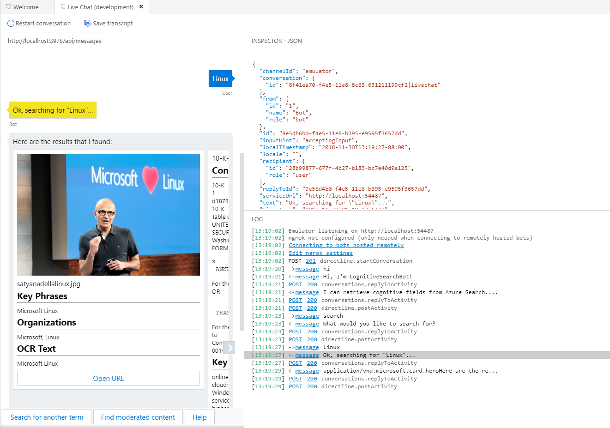
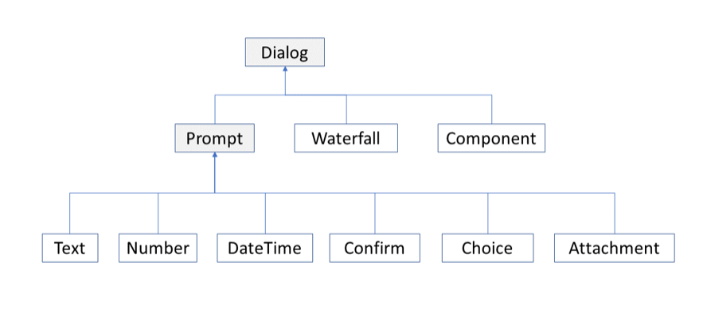
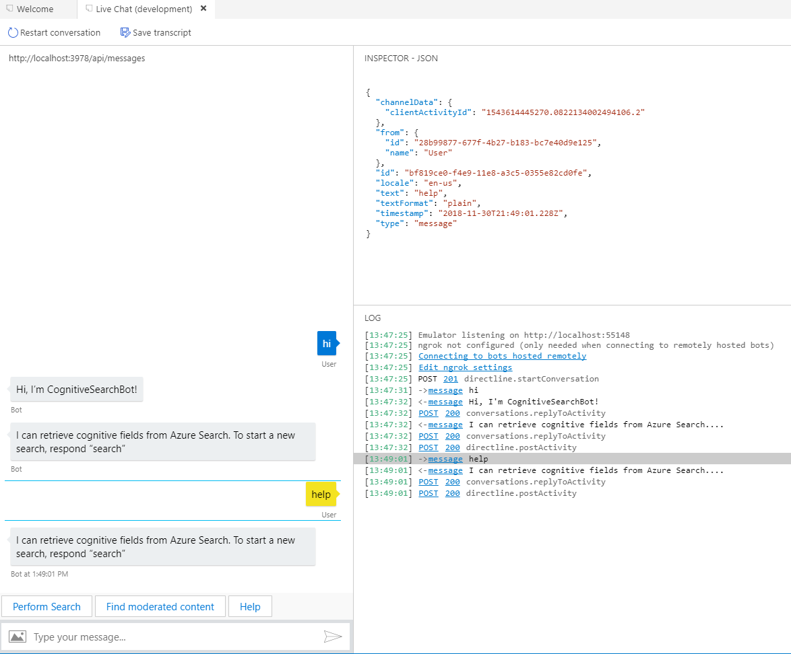
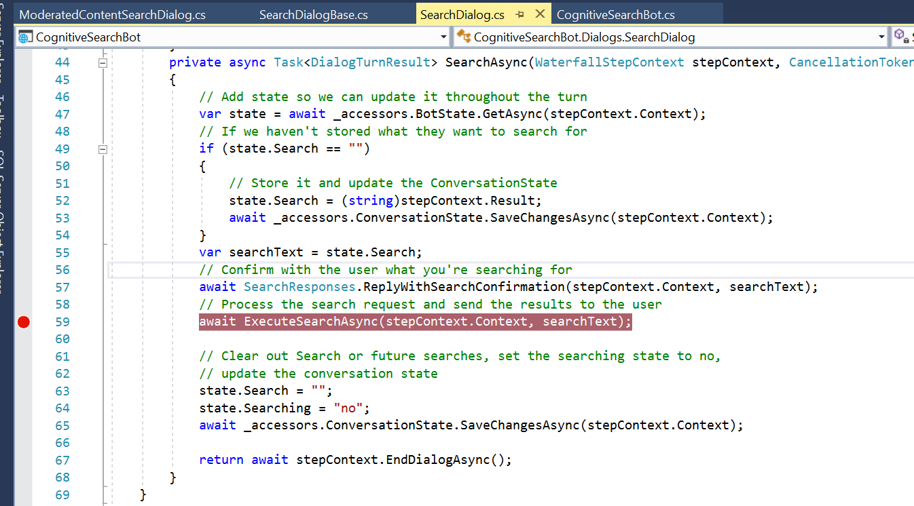
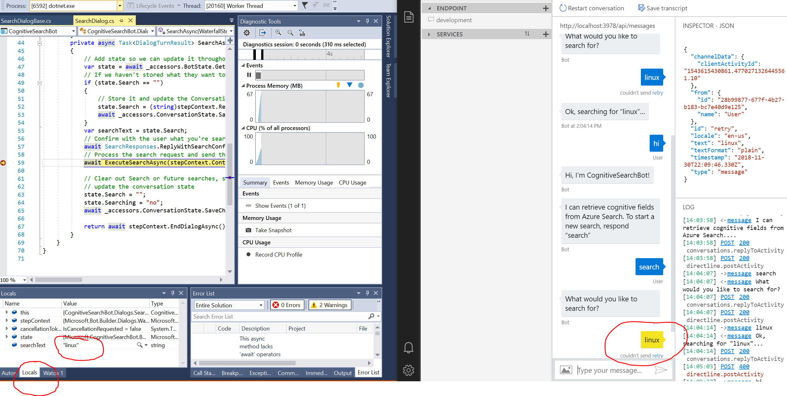

# Creating the Business Documents Bot

In this lab, you will learn how Azure Cognitive Search can be integrated into a bot using the Microsoft Bot Framework (SDK V4, .NET Core).
Since this is not a bot course, the creation has been taken care of for you. However, you'll get the chance to interact with your search service via the bot and use debugging to follow the processes to call the Azure Cognitive Search API and format results. If you're interested in diving deeper into bot development, check out the [LearnAI: Azure Cognitive Services Bootcamp](https://github.com/Azure/LearnAI-Bootcamp) which integrates multiple Cognitive Services to create an intelligent agent.

> **Note** While this is a simple bot, this [gif](../resources/images/lab-bot/retrieving-cognitive-attrributes.gif) provides some inspiration for what a solution could look like in a real estate scenario. Hopefully, it gives you some inspiration for what's possible. You could also integrate this into a web app, here is a [WebMD example](http://webmedsearch.azurewebsites.net/) and a [Seismic data example](http://seismicsearch.azurewebsites.net/).

The image below describes the bot created in this lab. Please notice that:

+ If you click on a chat message, the Bot Emulator will show you the JSON file of that interaction
+ The Log window shows you the status of the interactions
+ Preview of the files are loaded in a carousel
+ URLs are returned, you can click to open the files
+ There is a menu to help your search experience, you will be able to find moderated documents with one click

Important: The source code of the Bot was modified from the initial repo so it can be deployed in containers. The suggestion to complete this lab is to use Azure App Service Web App for containers

Let's start with an overview about Bots.

## Bot Framework V4

This lab's bot uses the Microsoft Bot Framework (V4), an open-source SDK available in Node.js, C#, Python and Java.

You can use the Microsoft Bot Framework to create a single code base to deploy with Azure Bot Service, which allows you to surface your bot on many channels (Skype, Cortana, Facebook, etc). The key concepts to know for this lab includes:

+ **Adapter:** The Bot orchestrator, routing incoming and outgoing communication and authentication. For any interaction, it creates a `TurnContext` object and passes it to the bot application logic

+ **Middleware:** The pipeline between the adapter and the bot code. It can be used to manage bot state

+ **Turn:** It is the action of the `TurnContext`been received by the bot. Normally there will be some processing and the bot will answer back to the user

+ **Dialogs** The way conversation flows through the bot. They are a central concept in the SDK, and provide a useful way to manage a conversation with the user. Dialogs are structures in your bot that act like functions in your bot's program; each dialog is designed to perform a specific task, in a specific order. You can specify the order of individual dialogs to guide the conversation, and invoke them in different ways - sometimes in response to a user, sometimes in response to some outside stimuli, or from other dialogs. Dialogs receive input from state or `OnTurn` function. Dialogs types:

  + **Prompt**: Provides an easy way to ask the user for information and evaluate their response. For example for a number prompt, you specify the question or information you are asking for, and the prompt automatically checks to see if it received a valid number response.
  + **Waterfall**: Specific implementation of a dialog that is commonly used to collect information from the user or guide the user through a series of tasks. Each step of the conversation is implemented as an asynchronous function that takes a waterfall step context, the `step` parameter. At each step, the bot prompts the user for input (or can begin a child dialog, but that it is often a prompt), waits for a response, and then passes the result to the next step. The result of the first function is passed as an argument into the next function, and so on.
  + **Component**: Provides a strategy for creating independent dialogs to handle specific scenarios, breaking a large dialog set into more manageable pieces. Each of these pieces has its own dialog set, and avoids any name collisions with the dialog set that contains it.

+ **State:** Stores data relating to either the conversation or the user. State is a middleware component. Available storage layers are Memory (data is cleared each time the bot is restarted), Blob Storage and CosmosDB. **State management** automates the reading and writing of your bot's state to the underlying storage layer.

Using the image below, check how all those concepts are integrated in the internal architecture of a bot application.

## Enterprise Grade Bots

Each bot is different, but there are some common patterns, workflows, and technologies to be aware of. Especially for a bot to serve enterprise workloads, there are many design considerations beyond just the core functionality.

[This](https://docs.microsoft.com/en-us/azure/architecture/reference-architectures/ai/conversational-bot) reference architecture describes how to build an enterprise-grade conversational bot (chatbot) using the Azure Bot Framework.

## Responsible Bots

In order for people and society to realize the full potential of bots, they need to be designed in such a way that they earn the trust of others. [These](https://www.microsoft.com/en-us/research/publication/responsible-bots/) guidelines are aimed at helping you to design a bot that builds trust in the company and service that the bot represents.

## Step 1 - Download and install the Bot Framework Emulator

The Bot Framework Emulator helps you run your bots locally for testing and debugging purposes. Download the emulator by going to [this page](https://github.com/Microsoft/BotFramework-Emulator/releases) and downloading the most recent version of the emulator that has the tag "Latest Release" (select the ".exe" file, if you are using windows). We suggest release 4.5.2 or newer.

> **Note** The instructions for the rest of the labs will assume you've downloaded the V4 Emulator (as opposed to the V3 Emulator).

The emulator installs to `c:\Users\`_your-username_`\AppData\Local\botframework\app-`_version_`\botframework-emulator.exe` or to your Downloads folder, depending on browser. Run the install and open the emulator, you'll use it shortly.

## Step 2 - Opening the Solution

As part of the environment creation lab, you should have cloned the repository to your local environment. If you have not, now is a good time to go back and do so.  

1. Under **resources > code-bot**, you should be able to locate a "Microsoft Visual Studio Solution File" called **CognitiveSearchBot.sln**. Double-click on it to open the solution in Visual Studio.  

1. Once the solution is open, in Solution Explorer, right-click on the  `CognitiveSearchBot` solution (from now on we'll just refer to this as "the solution") and select **Rebuild** to pull down all the dependencies required.  

1. Right-click on the solution and select **Manage NuGet Packages for Solution...** 

1. Under `Installed`, you should find `Microsoft.Azure.Search` listed. There's no action here, but you should know that this package contains libraries that make it very easy for us to call the Azure Cognitive Search API and process the results.

### Step 2.1 - Understanding the Code

There is a lot of "stuff" in this solution. If you've worked with bots before, you may be interested in looking around to see how we've set up the state, regular expressions, and the dialogs/responses. If you've never worked with bots before, do not fret! This is not a bots course, so we'll walk you through the important things we want you to learn.

> **NOTE** You can reference the [AI-100 learning](https://github.com/MicrosoftLearning/AI-100-Design-Implement-Azure-AISol) to become more familar with the bot framework and other cognitive services.

+ Let's search for some of the BFV4 components mentioned before.

  + In the Solution Explorer, check the folders that organize the code: **Dialogs, Middleware, Responses, Utilities**.

  + In the `Dialogs` folder, open **SearchDialogBase.cs** by double-clicking on it in the Solution Explorer. 
  
  >**Note** While there are lots of files in this solution, this is one of the most relevant. It does the integration with your search service. Spend at least five minutes reading the file **from start to finish**. We've commented what's happening on almost every line, so it is hopefully easy to follow, even if you don't have a background with bots. This code shows you how to interact with the Search service using C# and the Azure Cognitive Search SDK. Componets like `SearchResponses`, `ISearchIndexClient`, and `SearchHitStyler` optimize the development and organize the interaction with the Azure Cognitive Search Service.

  + In the same `Dialogs` folder, open the **MainDialog.cs** file. You can see how the state of the bot is managed within the `waterfalldialog`. At the end of the file you will see 3 `case` commands to route the main dialog, where you are now, the other possible dialogs of the bot. The interaction "help" drives the dialog straight to a response. Let's check them in the next item.

  + In the **Response** folder you will see the 2 possible responses of the bot, one for the results and the main response, with the other possible answers.

  + In the root folder, open the **Startup.cs** file. It has the regex code with all of the 3 possible intents and their middleware "injection".

  + In the Middleware folder, open the **CognitiveSearchBot.cs** file. It handles the `turnContext` object detecting the dialog context and starts the main dialog if necessary.

### Step 2.2 - Changing the code

1. Open the **Constants.cs** file.

1. Edit the string values to match your Azure environment resources. Since you've created and tested the index in Postman, you should have these readily available. If not, you can open the Azure portal and locate your Azure Cognitive Search service to get the needed information.

+ Search service name
+ Search service key
+ Index name (**demoindex**)

1. Save the file

>**Note** The Bot code has many references to the index fields from previous labs. If you did not complete those labs or if you did not name the content moderator field as **needsModeration** or the OCR field as **myOcrText**, you will need to change the code to use your fields names. The files to be changed are: /Dialogs/ModeratedContentSearchDialog.cs and /Models/SearchHit.cs 

## Step 3 - Interacting with your Cognitive Search Bot

1. In Visual Studio, press **F5** to build and run the bot locally.  

1. Open the Bot Emulator if it is not open already.

1. Select the button **Open Bot** from the Welcome page.

1. Select **Browse**, then navigate to the **BotConfiguration.bot** file in the **resources > code-bot** folder.

1. Select **Open**, then select **Connect**.  This should open a chat window with your bot. You can start by saying some sort of greeting ("hi", "hello", "whats up bot", etc.). The bot should respond with a greeting, followed by the help message that says what it can do.

1. Since really all it can do is search, enter **search** to trigger the search dialog. There is also a menu to avoid typing, it comes up right after the greeting. You can also ask for help, but the answer will be the same you had before.

1. Submit some search requests. Try searching for various items and inspecting your results. Try to search using both the menu button and typing search + enter + the term you want to search for.  If you're unsure what to search for, here are a few suggestions:

+ "satya nadella"
+ "financial reporting"
+ "security issues"
+ "Azure"
+ "cognitive services"
+ "cloud"
+ "sql server"
+ "learnai"
+ "reports"

## Step 4 - Using break points to understand the search flow

If you want to dive slightly deeper into calling the Azure Cognitive Search API and processing the results, we have provided some guidance on how to do so with break points.  

First, stop your bot (by hitting the stop button in Visual Studio).  

1. Open the **SearchDialog.cs** file. First, note that on line 3 there is a reference for CognitiveSearchBot, that is using the Azure Cognitive Search SDK (file **SearchDialogBase.cs**). Remember, this is crucial to running the commands you are about to step through.  

1. Next, scroll down to where the search related tasks are located. Place a break point on line 59, where there is the command `await ExecuteSearchAsync(stepContext.Context, searchText);`, by clicking in the grey area left of the numbers. You should see a red dot next to the break point lines, as shown below:  

1. Next, run the bot (select `F5`) and on the Bot Emulator, search for something. Anything works. Visual Studio will likely start blinking requesting your return. In Visual Studio, you should see the line about to be executed highlighted. Select `F11` repeatedly to step through what is happening as the search is processed. In the bottom box within Visual Studio, you should see "Locals". These values can be expanded and inspected. For example, when you should be able to see the search you just did.

Using break points for debugging and seeing how calls are made and processed is a very valuable tool. If you'd like to learn more, [start here](https://docs.microsoft.com/en-us/visualstudio/debugger/getting-started-with-the-debugger?view=vs-2017).  

> **Tip** Want to dive deeper into bot development? Check out the [LearnAI: Azure Cognitive Services Bootcamp](https://github.com/Azure/LearnAI-Bootcamp) which integrates multiple Cognitive Services to create an intelligent agent.

## Step 5 - Deploy your Bot using Azure App Service WebApp for Containers

To deploy your Bot successfully you have to add your appID and appPassword in the BotConfiguration.bot file, note that this option is not recommended to build new bots but it is useful for this hands on lab. Refer to the Bot Framework documentation for best practices on how to handle app settings.

Suggestions to deploy your Bot in Azure:

1. Create a new Web App for containers and copy your WebApp URL
1. Create a new Web App Bot by using the "+ Create a resource" within the Azure Portal
1. Provide a unique Bot Handle, Resource Group, Location, Pricing Tier, Unique App Name, select **Echo Bot C#** and select a new App Service Plan which can be a Free SKU
1. Go to the deployment results and select the Web App Bot, you will use this resource to made changes on the Bot Messaging endpoint and know what are the MicrosoftAppID and AppPassword.
1. Within the Web App Bot, click on Test in Web Chat and make sure that the echo bot works, just type a message and you will get a "echo" response.
1. Go to App Service Settings and locate your MicrosoftAppId and MicrosoftAppPassword, copy the values and update your BotConfiguration.bot file, also update the URL marked as "endpoint" using the WebApp URL on step 1.
1 . Within the Web App Bot, go to the settings tab and update the Messaging Endpoint to match the URL on step 1.
1. Deploy the CognitiveSearchBot solution in the Web App for containers created on the step 1, if you need help please check this Microsoft Learn course https://docs.microsoft.com/en-us/learn/modules/deploy-run-container-app-service/ or ask the trainer if you need additional help. Remember that you need to have Docker desktop (select the option Linux containers) so the build of the image is successfully  and it can be published into a new or existing Azure Container Registry.

For additional reference you can check [this](https://docs.microsoft.com/en-us/azure/bot-service/bot-builder-deploy-az-cli?view=azure-bot-service-4.0) tutorial and deploy your Bot to Azure.

After the deployment, execute the following activities:

+ Test your bot using the Azure Portal
+ Create a new channel and add your Bot so it can be used in Microsoft Teams
+ Create a new web chat channel so your Bot can be used in a Browser, you can see a simple web page that implements the minimum requirements within the CognitiveSearch solution within the wwwroot folder (default.html file)
+ Test your bot using the Bot Emulator, creating a new endpoint. Open this [link](https://github.com/Microsoft/BotFramework-Emulator/wiki/Getting-Started)
and follow the instructions to **Connecting to bots hosted remotely**
+ Optional: You can also try to [add your bot to Microsoft Teams](https://docs.microsoft.com/en-us/microsoftteams/platform/concepts/bots/bots-overview)

## Extra Content

If you want to learn more about bots:

+ Leverage the Conversational AI free trainings on [Microsoft AI School](https://aischool.microsoft.com/en-us/conversational/learning-paths).
+ Azure Bots Service [documentation](https://docs.microsoft.com/en-us/azure/bot-service/?view=azure-bot-service-4.0) has tutorials, quick starts, and samples.

## Cleaning your environment

You have completed all of the hands-on portions of the course. We recommend deleting the resource group (and all of the resources in it) to avoid incurring extra charges.

## Next Step

[Back to Read Me](../README.md)